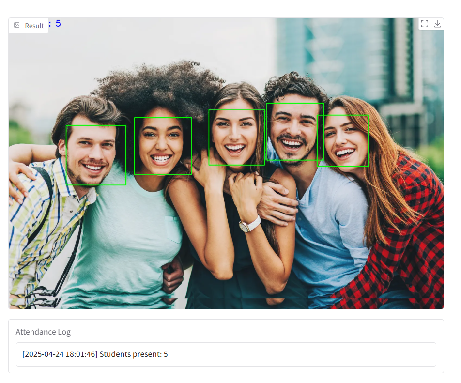

# Simple Face Detection System for Smart Classroom

## Setup Instruction

**Open Google Colab, Upload this ipynb file.**  
**Run the program, and open the URL:  Running on public URL: https://xxxx.gradio.live**  

---

## Features

### 1. Count Student Numbers
Using mediapipe for face detection, allowing for the use of either a webcam or uploaded images.

---

### 2. Privacy Protection in Attendance Log
Anonymize Faces (Pixelate)

---

### 3. Low-Light Adaption
Improve the lightness in dark environment

